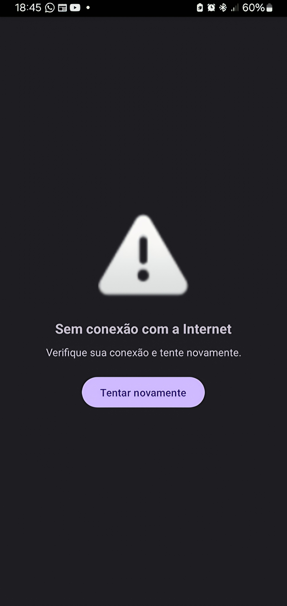

# 🌐 WebView Completo 4 em 1  

Um **aplicativo Android WebView** simples mas poderoso, com suporte offline, sistema de tentativas automáticas, abertura de links externos (WhatsApp, Facebook, YouTube, Maps, etc.) e confirmação ao sair do app com duplo toque no botão de voltar.  

Este repositório contém:  
- `MainActivity.java` → Lógica principal da aplicação.  
- `activity_main.xml` → Layout com WebView + Tela Offline.  
- `strings.xml` → Centralização de textos para fácil tradução/customização.  
- `AndroidManifest.xml` → Permissões e deep linking.  

---

## 🚀 Funcionalidades  
✅ Carrega qualquer site (definido em `strings.xml`)  
✅ Suporte a JavaScript e Local Storage  
✅ Modo offline com tela personalizada e botão de recarregar  
✅ Abertura de links externos em apps nativos (WhatsApp, Facebook, YouTube, Maps, etc.)  
✅ Sistema de "pressione duas vezes para sair"  
✅ Strings organizadas para tradução fácil  
✅ Suporte a **deep linking**  

---

## 📂 Estrutura do Projeto  

```
📦 Full_Complete_WebApp_WebView_4in1
 ┣ 📂 app/src/main/java/com/josemarpedro/Full_Complete_WebApp_WebView_4in1/MainActivity.java
 ┣ 📂 app/src/main/res/layout/activity_main.xml
 ┣ 📂 app/src/main/res/values/strings.xml
 ┣ 📂 app/src/main/AndroidManifest.xml
```

---

## ⚙️ Como Usar  

1. Clone o repositório:  
   ```bash
   git clone https://github.com/seu-usuario/Full_Complete_WebApp_WebView_4in1.git
   cd Full_Complete_WebApp_WebView_4in1
   ```

2. Abra o projeto no **Android Studio**.

3. Atualize o **nome do pacote** em:  
   - `MainActivity.java`  
   - `AndroidManifest.xml`  

4. Defina a URL do seu site em:  
   ```xml
   res/values/strings.xml
   <string name="site">https://seu-site.com</string>

   Padrão: www.google.com
   ```

5. Compile e execute no dispositivo Android.  

---

## 📜 Permissões  

Declaradas no `AndroidManifest.xml`:  
```xml
<uses-permission android:name="android.permission.ACCESS_NETWORK_STATE" />
<uses-permission android:name="android.permission.INTERNET" />
```

---

## 🔗 Deep Linking  

Configuração de exemplo:  
```xml
<data
   android:scheme="com.josemarpedro.Full_Complete_WebApp_WebView_4in1"
   android:host="auth" />
```

URLs possíveis:  
```
com.josemarpedro.Full_Complete_WebApp_WebView_4in1://auth
```

---

## 🛠 Tecnologias  
- **Java (Android)**  
- **WebView**  
- **ConstraintLayout**  

---

## 📸 Telas  

🔹 **Modo Online:** Exibe o site.  
🔹 **Modo Offline:** Mostra tela de erro + botão de recarregar.  
🔹 **Duplo Voltar:** Toast + saída confirmada.  

---

✍️ Autor: **Josemar Pedro**  
📌 Licença: código-aberto